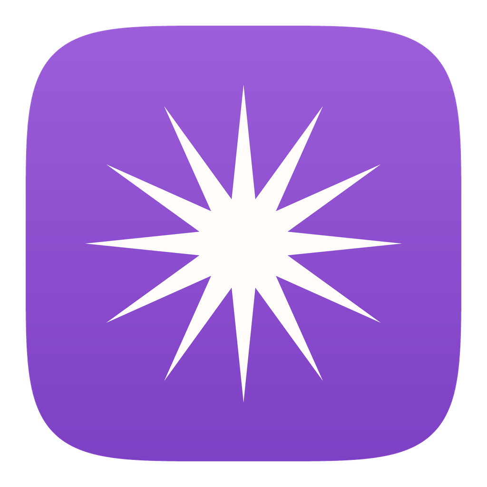

<div align="center">



# ClaudeDeck

**Every VS Code window, every Claude chat inside it, and what each one is
actually doing.**

</div>

---

Claude Code in VS Code gives you no way to see, across several windows and
several chats each, which of them is working, which finished, and which is
waiting on you. ClaudeDeck is that view: one window listing every chat grouped
by the VS Code window that owns it, with a status, the evidence behind it, and
how long ago it happened. Click a row to jump straight to that chat.

It also posts notifications, in the same shape as
[Claude Notify](https://github.com/huangsikai8/ClaudeNotify) — same wording,
same sounds — and badges its Dock icon with how many chats want you.

## The rule it is built around

**No false positives, no false negatives.** A status is shown only when it was
established from evidence. Anything that cannot be established says so.

Concretely, that means a status is displayed only when

1. an event or the transcript established it, **and**
2. the process that owns it is still alive, **and**
3. the record is newer than that process's start.

Any leg failing renders **Unknown**, with the reason underneath. A chat that was
running when its process died is `Ended`, never `Finished`. A chat that finished
before ClaudeDeck ever saw it is history, not news.

## Statuses

| | |
|---|---|
| **New** | Finished since you last looked — the one worth noticing |
| **Question** | A question is waiting for your answer |
| **Permission** | A permission request is waiting |
| **Running** | Turn in progress: a tool in flight, or a prompt pending |
| **Background** | The turn ended, but work it backgrounded has not reported back |
| **Rate limited** | The account rate limit was hit; Claude is not running |
| **Interrupted** | You interrupted it; the turn never completed |
| **Ended** | The process died before any completion was reported |
| **Finished** | Finished, and you have seen it |
| **Idle** | Tab open, nothing running behind it |
| **Unknown** | No status could be established |

New, Question and Permission are the three that badge the Dock and notify.

## How it fits together

```
VS Code window ─ extension host ─┬─ claude (chat)     ← ppid is the exact
                                 └─ claude (chat)        window↔chat link
       │
       ├─ extension/   ClaudeDeck bridge: publishes this window's pid,
       │               folders and chat tabs; focuses a tab on request
       │
       └─ state.vscdb  VS Code's own record of each tab's sessionID

~/.claude/
  projects/…/<session>.jsonl   transcripts — stop_reason, interrupts, titles
  claudedeck/
    windows/<extHostPid>.json  what each window published
    sessions/<sessionId>.json  what the hooks recorded
    seen.json, announced.json  what you have looked at, what was announced
    config.json                per-status animation, sound
    notify.log                 every banner posted or skipped
```

Status comes from three sources, ranked: **hook events** beat a **transcript**
reading of the same moment, the transcript beats nothing, and **process
liveness** overrides both.

## Install

```bash
git clone <this repo> && cd ClaudeDeck
./build.sh                                   # builds and installs to /Applications
```

Then the bridge extension, which nothing works without:

```bash
cd extension && zip -qr /tmp/claudedeck-bridge.vsix . && \
  code --install-extension /tmp/claudedeck-bridge.vsix --force
```

And the hooks, in `~/.claude/settings.json`:

```json
"Stop":              [{"hooks":[{"type":"command","command":"node \"$HOME/Projects/ClaudeDeck/hooks/claudedeck-hook.js\" stop"}]}],
"UserPromptSubmit":  [{"hooks":[{"type":"command","command":"node \"$HOME/Projects/ClaudeDeck/hooks/claudedeck-hook.js\" running"}]}],
"PermissionRequest": [{"hooks":[{"type":"command","command":"node \"$HOME/Projects/ClaudeDeck/hooks/claudedeck-hook.js\" permission"}]}],
"PostToolUse":       [{"hooks":[{"type":"command","command":"node \"$HOME/Projects/ClaudeDeck/hooks/claudedeck-hook.js\" resolved"}]}],
"PreToolUse":        [{"matcher":"AskUserQuestion","hooks":[{"type":"command","command":"node \"$HOME/Projects/ClaudeDeck/hooks/claudedeck-hook.js\" question"}]}]
```

Grant **Accessibility** (System Settings → Privacy & Security) so clicking a row
can raise the VS Code window, and allow **Notifications** for ClaudeDeck.

Check it:

```bash
"/Applications/ClaudeDeck.app/Contents/MacOS/ClaudeDeck" --check
"/Applications/ClaudeDeck.app/Contents/MacOS/ClaudeDeck" --test-banner
```

## Running alongside Claude Notify

Both post for the same events, so you get two banners and two sounds. Either
disable Claude Notify's hooks, or turn ClaudeDeck's sound off in its settings.
ClaudeDeck honours the same mute flag Claude Notify does
(`~/.claude/hooks/claude-notifier-muted`).

## Checks

```bash
./check.sh              # 9 derivation fixtures + 8 hook rules
./check.sh --survey     # also replays every transcript on this machine
```

Every fixture is a bug that shipped. The derivation cases call the same
`parseTranscript` the app uses, so a rule cannot pass here and fail in the app —
the same reason Claude Notify's `validate.js` replays through its shipped
scanner. **Add a fixture for every bug found from here on.**

Not covered yet: notification dedup, the memento lookup, the cwd fallback, and
rate-limit detection — all places bugs have already appeared.

## What was measured, not assumed

See [FINDINGS.md](FINDINGS.md): what a per-window extension can and cannot see,
why the window↔chat link is exact, and where the tab↔session link actually
lives. `extension-probe/` is the throwaway that established it.
